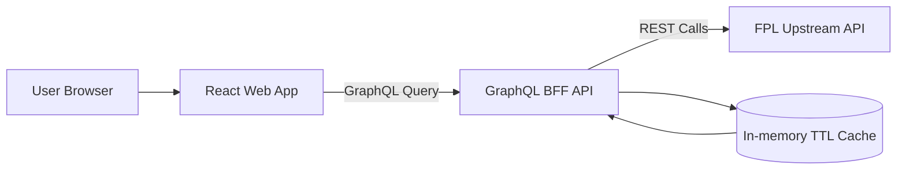
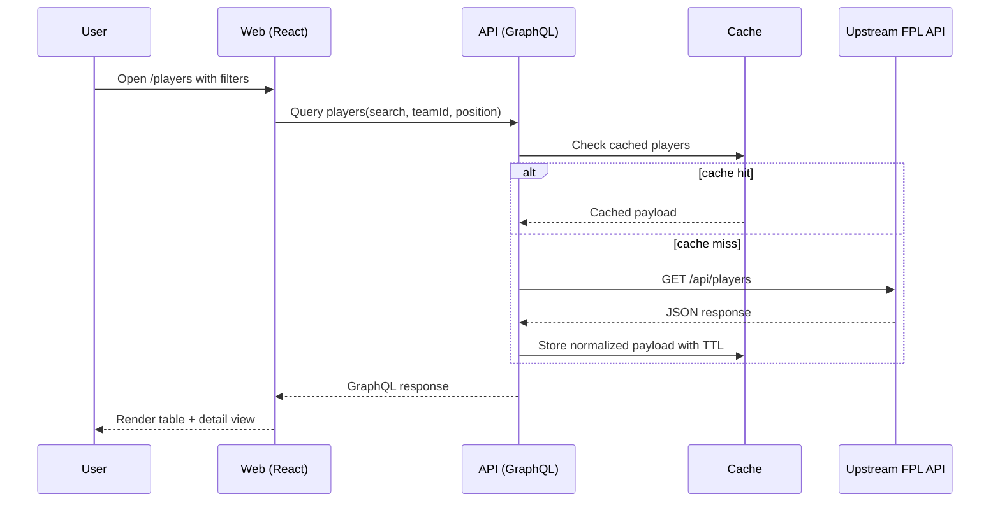

# FPL Companion

FPL Companion is a user-friendly Fantasy Premier League data browser built as a JavaScript monorepo.

It provides a GraphQL BFF API and a React frontend for viewing:
- Players
- Teams
- Fixtures
- Events / Gameweeks

## Tech Stack
- Frontend: React, Vite, Material UI, Apollo Client
- API: Node.js, Express, Apollo Server GraphQL
- Testing: Jest (unit/integration), Playwright (smoke E2E)
- Tooling: npm workspaces, ESLint, Prettier, GitHub Actions

## Monorepo Structure

```text
fpl-companion/
  apps/
    api/
    web/
  .github/
    workflows/ci.yml
  AGENTS.md
  README.md
```

## Architecture



## Request Flow



## Getting Started

### 1) Prerequisites
- Node.js 18.18+ (Node 20 recommended)
- npm 9+

### 2) Install

```bash
npm install
```

### 3) Run locally

```bash
npm run dev
```

- Web: http://localhost:5173
- API GraphQL: http://localhost:4000/graphql
- API Health: http://localhost:4000/healthz
- API Readiness: http://localhost:4000/readyz

### 4) Enable git pre-push checks (recommended)

```bash
npm run hooks:install
```

This installs a repository `pre-push` hook that runs:
- `npm run lint`
- `npm run test`

## Environment Variables

API variables (`apps/api/.env`):

| Variable | Default | Description |
|---|---|---|
| `PORT` | `4000` | API server port |
| `UPSTREAM_FPL_BASE_URL` | `https://fpl-api-tau.vercel.app` | Upstream FPL API base URL (use host root, not `/README`) |
| `UPSTREAM_TIMEOUT_MS` | `8000` | Upstream request timeout |
| `CACHE_TTL_PLAYERS_SEC` | `300` | Player cache TTL |
| `CACHE_TTL_TEAMS_SEC` | `900` | Team cache TTL |
| `CACHE_TTL_FIXTURES_SEC` | `120` | Fixture cache TTL |
| `CACHE_TTL_EVENTS_SEC` | `900` | Event cache TTL |

Web variables (`apps/web/.env`):

| Variable | Default | Description |
|---|---|---|
| `VITE_GRAPHQL_URL` | `http://localhost:4000/graphql` | GraphQL endpoint used by frontend |

## Scripts

At repo root:

```bash
npm run dev
npm run lint
npm run test
npm run test:e2e:smoke
npm run build
npm run hooks:install
```

## Docker

```bash
docker compose up --build
```

- API available on port `4000`
- Web available on port `4173`

## GraphQL Query Surface

`Query` supports:
- `players(search, teamId, position, limit, offset)`
- `player(id)`
- `teams(orderBy, first, limit, offset)`
- `teamsConnection(orderBy, first, offset)`
- `team(id)`
- `fixtures(eventId, teamId, finished, limit, offset)`
- `fixture(id)`
- `events`
- `event(id)`

## Testing Strategy
- API: resolver, datasource, mapper, cache, config tests.
- Web: component and route tests with mocked GraphQL.
- E2E: smoke scenarios for list/detail/filter and API-down error handling.
- CI enforces lint, test, build, and smoke E2E checks.

## Troubleshooting

### Upstream API unavailable
Symptoms:
- `UPSTREAM_UNAVAILABLE` or `UPSTREAM_TIMEOUT` GraphQL errors.
- `/readyz` returns `503` with `status: degraded`.

What to do:
1. Confirm upstream URL and connectivity.
2. Increase `UPSTREAM_TIMEOUT_MS` for unstable networks.
3. Use cached responses while upstream recovers (already enabled by stale fallback).

### Empty or partial data
1. Verify upstream payload shape has required fields.
2. Check API logs for dropped invalid records.
3. Validate filters in URL query params.
