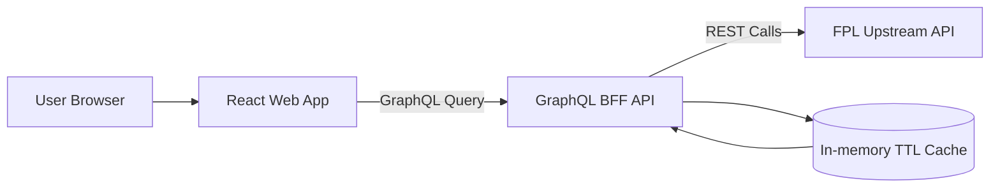
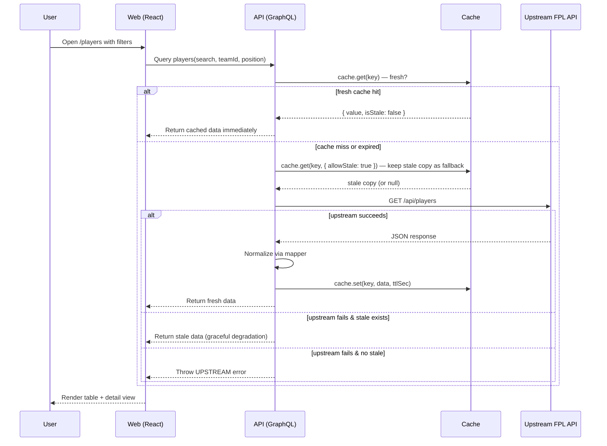

# FPL Companion

FPL Companion is a user-friendly Fantasy Premier League data browser built as a JavaScript monorepo.

It provides a GraphQL BFF API and a React frontend for viewing:

- Players
- Teams
- Fixtures
- Events / Gameweeks

## Tech Stack

- Frontend: React, Vite, Material UI, Apollo Client
- API: Node.js, Express, Apollo Server GraphQL
- Testing: Jest (unit/integration), Playwright (smoke E2E)
- Tooling: npm workspaces, ESLint, Prettier, GitHub Actions

## Monorepo Structure

```text
fpl-companion/
  apps/
    api/
    web/
  .github/
    workflows/ci.yml
  AGENTS.md
  README.md
```

## Architecture



### API upstream modules

`apps/api/src/upstream/` is now split so `FplDataSource` stays a thin facade:

- `fplDataSource.js` — public datasource class, cache orchestration, readiness flow.
- `upstreamTransport.js` — request target generation, path/base URL fallback, timeout handling, JSON parse fallback, upstream error mapping.
- `payloadExtractors.js` — list/object payload extraction helpers.
- `entityDescriptors.js` — per-entity endpoint/cache/mapper metadata.
- `healthState.js` — health state creation/update and readiness payload formatting.
- `mappers.js` — upstream payload normalization into API-facing shapes.

## Request Flow



## In-Memory Cache

The API uses a lightweight in-memory TTL cache (`InMemoryCache`) backed by a JavaScript `Map`. Each entry stores the data alongside an expiration timestamp.

### How it works

| Operation                        | Behaviour                                                                                                               |
| -------------------------------- | ----------------------------------------------------------------------------------------------------------------------- |
| `set(key, value, ttlSec)`        | Stores `{ value, expiresAt: now + ttl }`. TTL is floored at 1 second.                                                   |
| `get(key)`                       | Returns `{ value, isStale: false }` if the entry exists **and** has not expired. Returns `null` otherwise (cache miss). |
| `get(key, { allowStale: true })` | Same as above, but also returns **expired** entries as `{ value, isStale: true }` instead of `null`.                    |

### Stale-fallback pattern

The datasource (`FplDataSource`) reads the cache in a two-pass pattern:

```text
1.  cache.get(key)                     → Fresh hit? Return immediately — no network call.
2.  cache.get(key, { allowStale })     → Hold the stale copy aside (may be null).
3.  Fetch from upstream FPL API.
4a. Upstream succeeds                  → Normalize, cache.set(), return fresh data.
4b. Upstream fails + stale exists      → Return stale data (graceful degradation).
4c. Upstream fails + no stale          → Throw error (UPSTREAM_UNAVAILABLE / UPSTREAM_TIMEOUT).
```

This ensures users keep seeing data even when the upstream API is temporarily down — the cache serves expired entries as a safety net until the upstream recovers. Per-resource TTLs (e.g. 5 min for players, 2 min for fixtures) are configured via environment variables.

### Why not Redis?

A `RedisCacheAdapter` stub exists for future use, but the MVP uses the in-memory cache to avoid external dependencies. The cache interface (`set`/`get`) is identical, so swapping to Redis requires only a config change.

## Getting Started

### 1) Prerequisites

- Node.js 18.18+ (Node 20 recommended)
- npm 9+
- **Chrome DevTools MCP** (optional, for AI agent browser testing): Node 20.19.0+ required. `.nvmrc` pins this version — run `nvm install` or `fnm install` once to activate it.

### 2) Install

```bash
npm install
```

### 3) Run locally

```bash
npm run dev
```

- Web: http://localhost:5173
- API GraphQL: http://localhost:4000/graphql
- API Health: http://localhost:4000/healthz
- API Readiness: http://localhost:4000/readyz

### 4) Enable git pre-push checks (recommended)

```bash
npm run hooks:install
```

This installs a repository `pre-push` hook that runs:

- `npm run check:yaml`
- `npm run lint`
- `npm run test`

## Environment Variables

API variables (`apps/api/.env`):

| Variable                 | Default                          | Description                                              |
| ------------------------ | -------------------------------- | -------------------------------------------------------- |
| `PORT`                   | `4000`                           | API server port                                          |
| `UPSTREAM_FPL_BASE_URL`  | `https://fpl-api-tau.vercel.app` | Upstream FPL API base URL (use host root, not `/README`) |
| `UPSTREAM_TIMEOUT_MS`    | `8000`                           | Upstream request timeout                                 |
| `CACHE_TTL_PLAYERS_SEC`  | `300`                            | Player cache TTL                                         |
| `CACHE_TTL_TEAMS_SEC`    | `900`                            | Team cache TTL                                           |
| `CACHE_TTL_FIXTURES_SEC` | `120`                            | Fixture cache TTL                                        |
| `CACHE_TTL_EVENTS_SEC`   | `900`                            | Event cache TTL                                          |

Web variables (`apps/web/.env`):

| Variable           | Default                         | Description                       |
| ------------------ | ------------------------------- | --------------------------------- |
| `VITE_GRAPHQL_URL` | `http://localhost:4000/graphql` | GraphQL endpoint used by frontend |

## Scripts

At repo root:

```bash
npm run dev
npm run check:yaml      # validate YAML files and frontmatter
npm run format          # check formatting (Prettier)
npm run format:write    # auto-fix formatting
npm run lint
npm run test
npm run test:e2e:smoke
npm run build           # production build (all workspaces)
npm run preview         # serve the production web build locally (http://localhost:4173)
npm run hooks:install
```

### Production preview

To run and audit the production build locally:

```bash
npm run build
npm run preview
```

The preview server (`vite preview`) serves the pre-built `apps/web/dist/` as a static site — no HMR, no dev transforms. Use this for accurate Lighthouse measurements instead of the dev server.

## Frontend Features

| Page      | Features                                                                                                                           |
| --------- | ---------------------------------------------------------------------------------------------------------------------------------- |
| Players   | Sortable columns (Total Points, Form, Price); player comparison panel (select up to 3 via checkbox, state in URL `?compare=1,2,3`) |
| Fixtures  | FDR (Fixture Difficulty Rating) colour chips in H Diff / A Diff columns                                                            |
| Teams     | Detail panel includes W/D/L, Points, and all six FPL strength ratings                                                              |
| Dashboard | "Top Total Points" and "Most Transferred In" cards                                                                                 |

## Frontend Architecture

### Code splitting

All page components (`DashboardPage`, `PlayersPage`, `TeamsPage`, `FixturesPage`, `EventsPage`) are lazy-loaded via `React.lazy()` with a `<Suspense>` fallback. This reduces the initial JS parse time (only the shell + current route's code loads on first paint).

### Build chunks

The Vite production build splits output into stable vendor chunks for effective browser caching across deploys:

| Chunk           | Contents                                             |
| --------------- | ---------------------------------------------------- |
| `vendor-react`  | `react`, `react-dom`, `react-router-dom`             |
| `vendor-apollo` | `@apollo/client`, `graphql`                          |
| `vendor-mui`    | `@mui/material`, `@emotion/react`, `@emotion/styled` |

## Docker

```bash
docker compose up --build
```

- API available on port `4000`
- Web available on port `4173`

## GraphQL Query Surface

`Query` supports:

- `players(search, teamId, position, orderBy: PlayerOrderBy, limit, offset)` — `orderBy` accepts `{ field: PlayerOrderField, direction: SortDirection }` to server-side sort by `totalPoints`, `form`, `nowCost`, or `transfersInEvent`
- `player(id)`
- `playersByIds(ids: [Int!]!)` — batch fetch up to 10 players by ID; de-duplicates IDs server-side
- `teams(orderBy, first, limit, offset)`
- `teamsConnection(orderBy, first, offset)`
- `team(id)` — includes W/D/L, points, and all six FPL strength ratings
- `fixtures(eventId, teamId, finished, limit, offset)` — response includes `teamHDifficulty` / `teamADifficulty` (FDR 1–5)
- `fixture(id)`
- `events`
- `event(id)`

## Testing Strategy

- API: resolver, datasource, mapper, cache, config tests.
- Web: component and route tests with mocked GraphQL.
- E2E: smoke scenarios for list/detail/filter and API-down error handling.
- CI enforces format, lint, test, build, and smoke E2E checks.
- CI uses `npm ci` for reproducible installs and caches Playwright browsers.

## Troubleshooting

### Upstream API unavailable

Symptoms:

- `UPSTREAM_UNAVAILABLE` or `UPSTREAM_TIMEOUT` GraphQL errors.
- `/readyz` returns `503` with `status: degraded`.

What to do:

1. Confirm upstream URL and connectivity.
2. Increase `UPSTREAM_TIMEOUT_MS` for unstable networks.
3. Use cached responses while upstream recovers (already enabled by stale fallback).

### Empty or partial data

1. Verify upstream payload shape has required fields.
2. Check API logs for dropped invalid records.
3. Validate filters in URL query params.
